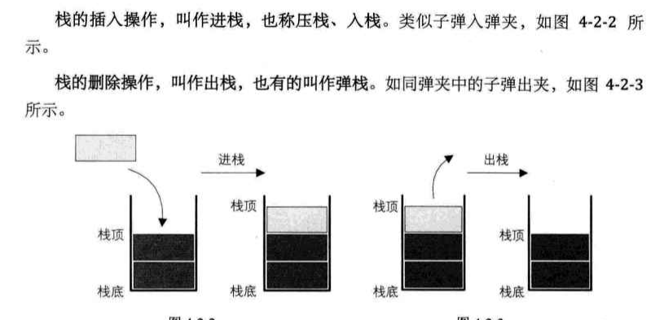
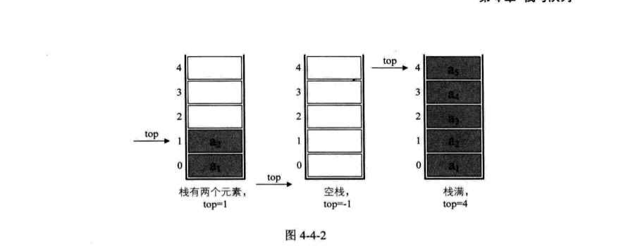
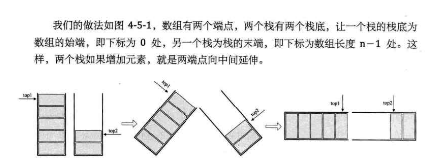
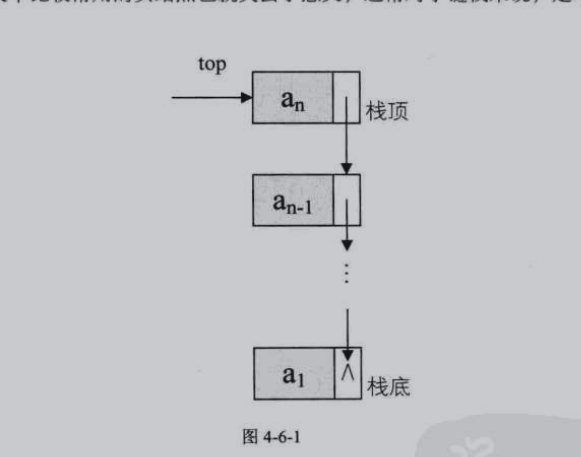
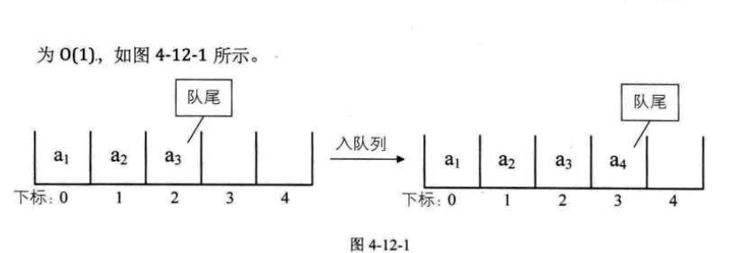
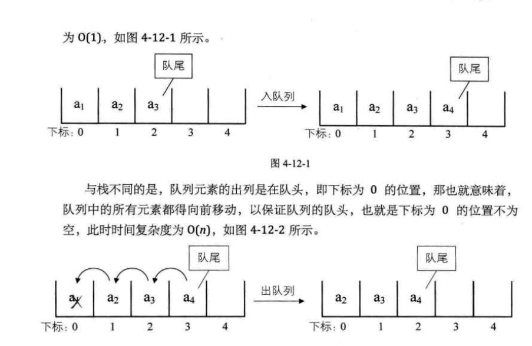

### 栈和队列  
- 栈的定义  
    栈【stack】是限定仅在表尾进行插入和删除操作的线性表    
    
    允许插入和删除的一端称为栈顶【top】，另一端称为栈底【bottom】  
    没有任何数据元素的称为空栈，栈也称为【last in first out】简称LIFO结构     
    
    栈的插入操作称为进栈，压栈，入栈  
    栈的删除操作称为出栈，弹栈  
    
      
    
- 栈的顺序存储结构  
    线性表的顺序存储结构特例，栈一样叫顺序栈   
    
      
    
    [进栈与出栈测试源码](stack.c)  
    
- 两栈共享空间    
     
    
    n【9】 +1=10
    m【9】
    
    栈底 -1 0 1 2 3 4 5 top1| top2 1 2 3 4 5 栈底  
    top1为空时 top1=-1  
    top2为空时 top2=n  
    
    top1栈满时 top1=n-1  
    top2栈满时 top2=top1+1 【top2=0】    
    
    [双栈空间代码实现测试](stack.c)  
    
- 栈的链式存储结构   
   栈的链式存储结构称为链栈    
   

   进栈操作  
     
   
   [链栈操作测试源码](linkstack.c)
   
- 栈的作用  
    斐波那契数列   
    [测试源码](fbi.c)  
    
    
- 队列定义   
    队列是只允许一端进行插入，另一端删除的线性表 
    
    队列【queue】是一种先进先出的线性表，first in first out 简称FIFO  
    允许插入的那一端为队尾，允许删除的那一端为队头  
    
      
    
      
    
      
    
- 队列顺序存储结构  
    问题太多，性能low  
    
    
- 队列链式存储结构  
    链队列  
    
    [链队测试源码](queue.c)