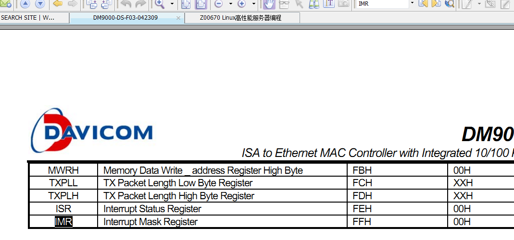

### 网卡芯片工作原理说明
- [驱动原理](https://blog.csdn.net/b02330224/article/details/7895724)
- 芯片具体手册
具体手册可联系本人获取

- 工作大体说明
通过【读写时序图】AEN,CMD,IOR,IOW等引脚控制信号来完成数据的读写操作
接受和发送的数据全保存在SRAM【静态随机存储器，可以实现通电随机读写操作】
TX发送的数据是保存在TX SRAM里的，接受RX也是一样，发送和接受的数据都会经过
各种转换电路处理，在TX,RX端口都有一个变压器最终输出到RJ水晶头


数据存储电路SRAM和EEPROM【可存储芯片的MAC地址，6个字节】

网卡芯片进行通信的前提是知道双方【发送和接收方】的mac地址，mac地址可以存储在EEPROM可
电擦除寄存器里。

发送数据的前提：
1、知道mac地址
2、要发送的数据

根据tcp/ip协议，驱动程序会编写一个ARP程序负责将目的ip地址转换为mac地址
转换过程：是arp程序发起一个arp请求，网络中的网卡响应【arp响应】时会返回一个mac地址

tcp/ip协议至于封装的tcp,ip,以太网头[mac]只是一个规定，但低层通信只需要知道mac
和要发送的数据就可以了

- tcp/ip
数据通过应用层，传输层，网络，数据链路层封装
封装结果：
以太网目标物理地址|源物理地址|2个字节帧类型|数据|CRC

分用：
针对接收的时候

根据帧类型是ARP请求还是IP头，分别发给不同的协议【程序】来处理
TCP,UDP他们都是用IP协议的，会根据IP头的16位[端口】区分上层的应用程序
如http,dns,redis,mysql这些

根据以太网帧头来区分是ARP,IP协议
根据IP16位来区分是TCP,UDP
根据TCP/UDP的16位端口来区分上层应用程序

- 芯片写时序
```c
void dm9000_reg_write(unsigned char reg, unsigned char data)

{

PIO1 = reg;

AEN = 0;

CMD = 0;

IOR = 1;

IOW = 0;

udelay(1);

AEN = 1;

IOW = 1;

udelay(20);

PIO1 = data;

AEN = 0;

CMD = 0;

IOR = 1;

IOW = 0;

udelay(1);

AEN = 1;

IOW = 1;

}
```
- 读写数据驱动程序
```c
//发送数据包

//参数：datas为要发送的数据缓冲区（以字节为单位），length为要发送的数据长度（两个字节）。

void sendpacket(unsigned char *datas, unsigned int length)

{
    unsigned int len, i;
    dm9000_reg_write(IMR, 0x80);//先禁止网卡中断，防止在发送数据时被中断干扰
    len = length;

    dm9000_reg_write(TXPLH, (len>>8) & 0x0ff);

    dm9000_reg_write(TXPLL, len & 0x0ff);

/*这两句是将要发送数据的长度告诉DM9000的寄存器*/

    DM_ADD = MWCMD;//这里的写法是针对有总线接口的处理器，没有总线接口的处理器要注意加上时序。

    for(i=0; i<len; i+=2)//16 bit mode

    {

        udelay(20);

        DM_CMD = datas[i] | (datas[i+1]<<8);

    }

/*上面是将要发送的数据写到DM9000的内部SRAM中的写FIFO中，注意没有总线接口的处理器要加上适当的时序*/

/*只需要向这个寄存器中写数据即可，MWCMD是DM9000内部SRAM的DMA指针，根据处理器模式，写后自动增加*/

    dm9000_reg_write(TCR, 0x01);//发送数据到以太网上

    while((dm9000_reg_read(NSR) & 0x0c) == 0);//等待数据发送完成

    udelay(20);

    dm9000_reg_write(NSR, 0x2c);//清除状态寄存器，由于发送数据没有设置中断，因此不必处理中断标志位

    dm9000_reg_write(IMR, 0x81);//DM9000网卡的接收中断使能

}
```



读数据驱动
```c
//接收数据包

//参数：datas为接收到是数据存储位置（以字节为单位）

//返回值：接收成功返回数据包类型，不成功返回0

unsigned int receivepacket(unsigned char *datas)

{

    unsigned int i, tem;

    unsigned int status, len;

    unsigned char ready;

    ready = 0;//希望读取到“01H”

    status = 0;//数据包状态

     len = 0; //数据包长度

/*以上为有效数据包前的4个状态字节*/

    if(dm9000_reg_read(ISR) & 0x01)

    {

        dm9000_reg_write(ISR, 0x01);

    }

/*清除接收中断标志位*/

/***********************************************************************************/

/*这个地方遇到了问题，下面的黑色字体语句应该替换成成红色字体，也就是说MRCMDX寄存器如果第一次读不到数据，还要读一次才能确定完全没有数据。

在做 PING 实验时证明：每个数据包都是通过第二次的读取MRCMDX寄存器操作而获知为有效数据包的，对初始化的寄存器做了多次修改依然是此结果，但是用如下方法来实现，绝不会漏掉数据包。*/

    ready = dm9000_reg_read(MRCMDX); // 第一次读取，一般读取到的是 00H

    if((ready & 0x0ff) != 0x01)

    {

        ready = dm9000_reg_read(MRCMDX); // 第二次读取，总能获取到数据

        if((ready & 0x01) != 0x01)

         {

            if((ready & 0x01) != 0x00) //若第二次读取到的不是 01H 或 00H ，则表示没有初始化成功

            {

                 dm9000_reg_write(IMR, 0x80);//屏幕网卡中断

                 DM9000_init();//重新初始化

                 dm9000_reg_write(IMR, 0x81);//打开网卡中断

            }

            retrun 0;

         }

    }

/* ready = dm9000_reg_read(MRCMDX); // read a byte without pointer increment

    if(!(ready & 0x01))

    {

         return 0;

    }*/

/***********************************************************************************/

/*以上表示若接收到的第一个字节不是“01H”，则表示没有数据包，返回0*/

    status = dm9000_reg_read(MRCMD);

    udelay(20);

    len = DM_CMD;

    if(!(status & 0xbf00) && (len < 1522))

    {

        for(i=0; i<len; i+=2)// 16 bit mode

        {

            udelay(20);

            tem = DM_CMD;

            datas[i] = tem & 0x0ff;

            datas[i + 1] = (tem >> 8) & 0x0ff;

        }

    }

    else

    {
        return 0;

    }

/*以上接收数据包，注意的地方与发送数据包的地方相同*/

    if(len > 1000) return 0;

    if( (HON( ETHBUF->type ) != ETHTYPE_ARP) &&

        (HON( ETHBUF->type ) != ETHTYPE_IP) )

    {

        return 0;

    }

    packet_len = len;

/*以上对接收到的数据包作一些必要的限制，去除大数据包，去除非ARP或IP的数据包*/
    return HON( ETHBUF->type ); //返回数据包的类型，这里只选择是ARP或IP两种类型

}
```

- 以太网头部结构体
```c
unsigned char Buffer[1000];//定义了一个1000字节的接收发送缓冲区

uint16 packet_len;//接收、发送数据包的长度，以字节为单位。

struct eth_hdr //以太网头部结构，为了以后使用方便

{

unsigned char d_mac[6];   //目的地址

unsigned char s_mac[6];   //源地址

uint16 type;     //协议类型

};
```

ARP头部
```c
struct arp_hdr //以太网头部+ARP首部结构

{

struct eth_hdr ethhdr;    //以太网首部

uint16 hwtype;     //硬件类型(1表示传输的是以太网MAC地址)

uint16 protocol;    //协议类型(0x0800表示传输的是IP地址)

unsigned char hwlen;     //硬件地址长度(6)

unsigned char protolen;    //协议地址长度(4)

uint16 opcode;     //操作(1表示ARP请求,2表示ARP应答)

unsigned char smac[6];    //发送端MAC地址

unsigned char sipaddr[4];    //发送端IP地址

unsigned char dmac[6];    //目的端MAC地址

unsigned char dipaddr[4];    //目的端IP地址

};
```

以太网头部+IP
```c
struct ip_hdr //以太网头部+IP首部结构

{

struct eth_hdr ethhdr;    //以太网首部

unsigned char vhl,      //4位版本号4位首部长度(0x45)

tos;     //服务类型(0)

uint16 len,      //整个IP数据报总字节长度

ipid,           //IP标识

ipoffset;     //3位标识13位偏移

unsigned char ttl,             //生存时间(32或64)
proto;         //协议(1表示ICMP,2表示IGMP,6表示TCP,17表示UDP)

uint16 ipchksum;    //首部校验和

unsigned char srcipaddr[4],    //源IP

             destipaddr[4];   //目的IP

};
```

-  ARP协议的实现
   1、ARP协议原理简述

       ARP协议（Address Resolution Protocol 地址解析协议），在局域网中，网络中实际传输的是“

   帧”，帧里面有目标主机的MAC地址。在以太网中，一个注意要和另一个主机进行直接通信，必须要知

   道目标主机的MAC地址。这个MAC地址就是标识我们的网卡芯片唯一性的地址。但这个目标MAC地址是如

   何获得的呢？这就用到了我们这里讲到的地址解析协议。所有“地址解析”，就是主机在发送帧前将目

   标IP地址转换成MAC地址的过程。ARP协议的基本功能就是通过目标设备的IP地址，查询目标设备的MAC

   地址，以保证通信的顺利进行。所以在第一次通信前，我们知道目标机的IP地址，想要获知目标机的

   MAC地址，就要发送ARP报文（即ARP数据包）。它的传输过程简单的说就是：我知道目标机的IP地址，

   那么我就向网络中所有的机器发送一个ARP请求，请求中有目标机的IP地址，请求的意思是目标机要是

   收到了此请求，就把你的MAC地址告诉我。如果目标机不存在，那么此请求自然不会有人回应。若目标

   机接收到了此请求，它就会发送一个ARP应答，这个应答是明确发给请求者的，应答中有MAC地址。我接

   到了这个应答，我就知道了目标机的MAC地址，就可以进行以后的通信了。因为每次通信都要用到MAC地

   址。

 
 注意，以太网的传输存储是“大端格式”，即先发送高字节后发送低字节。例如，两个字节的数据

 ，先发送高8位后发送低8位。所以接收数据的时候要注意存储顺序。

 整个报文分成两部分，以太网首部和ARP请求/应答。下面挑重点讲述。

 “以太网目的地址”字段：若是发送ARP请求，应填写广播类型的MAC地址FF-FF-FF-FF-FF-FF，意思是

 让网络上的所有机器接收到；

 “帧类型”字段：填写08-06表示次报文是ARP协议；

 “硬件类型”字段：填写00-01表示以太网地址，即MAC地址；

 “协议类型”字段：填写08-00表示IP，即通过IP地址查询MAC地址；

 “硬件地址长度”字段：MAC地址长度为6（以字节为单位）；

 “协议地址长度”字段：IP地址长度为4（以字节为单位）；

 “操作类型”字段：ARP数据包类型，0表示ARP请求，1表示ARP应答；

 “目的以太网地址”字段：若是发送ARP请求，这里是需要目标机填充的。

 - ARP驱动程序
 - ARP请求源码
 ```c
 unsigned char mac_addr[6] = {*，*，*，*，*，*};

 unsigned char ip_addr[4] = { 192, 168, *, * };

 unsigned char host_ip_addr[4] = { 192, 168, *, * };

 unsigned char host_mac_addr[6]={ 0xff, 0xff, 0xff, 0xff, 0xff, 0xff };

 unsigned char Buffer[1000];

 uint16 packet_len;

 /*这些全局变量，在前面将的文件中有些已经有过定义，这里要注意在前面加上“extern”关键字。“

 *”应该根据自己的机器修改*/

 #define HON(n) ((((uint16)((n) & 0xff)) << 8) | (((n) & 0xff00) >> 8))

 /*此宏定义是将小端格式存储的字（两个字节）转换成大端格式存储*/

 void arp_request(void) //发送ARP请求数据包

 {

 //以太网首部

 memcpy(ARPBUF->ethhdr.d_mac, host_mac_addr, 6);

 /*字符串拷贝函数，文件要包含<string.h>头文件。参数依次是，拷贝目标指针，拷贝数据源指针，拷

 贝字符数*/

 memcpy(ARPBUF->ethhdr.s_mac, mac_addr, 6);

 ARPBUF->ethhdr.type = HON( 0x0806 );

 /*小端格式的编译器，可以用HON()宏来转换成大端格式，如果你的编译器是大端格式，直接填写

 0x0806即可*/

 /*就是简单的按照协议格式填充，以下同*/

 //ARP首部

 ARPBUF->hwtype = HON( 1 );

 ARPBUF->protocol = HON( 0x0800 );

 ARPBUF->hwlen = 6;

 ARPBUF->protolen = 4;

 ARPBUF->opcode = HON( 0 );

 memcpy(ARPBUF->smac, mac_addr, 6);

 memcpy(ARPBUF->sipaddr, ip_addr, 4);

 memcpy(ARPBUF->dipaddr, host_ip_addr, 4);

 packet_len = 42;//14+28=42

 sendpacket( Buffer, packet_len );

 }
 ```

 - ARP响应源码
 ```c
 unsigned char arp_process(void)//ARP接收函数，成功返回1，否则返回0

 {

 //简单判断ARP数据包有无损坏,有损坏则丢弃,不予处理

 if( packet_len < 28 )//ARP数据长度为28字节为无效数据

 {

 return 0;

 }

 switch ( HON( ARPBUF->opcode ) )

 {

    case 0    : //处理ARP请求

          if( ARPBUF->dipaddr[0] == ip_addr[0] &&

              ARPBUF->dipaddr[1] == ip_addr[1] &&

              ARPBUF->dipaddr[2] == ip_addr[2] &&

              ARPBUF->dipaddr[3] == ip_addr[3] )//判断是否是自己的IP，是否向自己询问MAC地址

 。

          {
              ARPBUF->opcode = HON( 2 );//设置为ARP应答

              memcpy(ARPBUF->dmac, ARPBUF->smac, 6);

              memcpy(ARPBUF->ethhdr.d_mac, ARPBUF->smac, 6);

              memcpy(ARPBUF->smac, mac_addr, 6);

              memcpy(ARPBUF->ethhdr.s_mac, mac_addr, 6);

              memcpy(ARPBUF->dipaddr, ARPBUF->sipaddr, 4);

              memcpy(ARPBUF->sipaddr, ip_addr, 4);

              ARPBUF->ethhdr.type = HON( 0x0806 );

              packet_len = 42;

              sendpacket( Buffer, packet_len );//发送ARP数据包

              return 1;

          }

          else

          {

              return 0;

          }

          break;

    case 1    : //处理ARP应答

          if( ARPBUF->dipaddr[0] == ip_addr[0] &&

              ARPBUF->dipaddr[1] == ip_addr[1] &&

              ARPBUF->dipaddr[2] == ip_addr[2] &&

              ARPBUF->dipaddr[3] == ip_addr[3] )//再次判断IP，是否是给自己的应答

          {

           memcpy(host_mac_addr, ARPBUF->smac, 6);//保存服务器MAC地址

           return 1;

          }

          else

          {

              return 0;

          }

          break;

 default     ://不是ARP协议

          return 0;

 }

 }
 ```
 - IPV4头部结构
 

 - 测试ICMP协议的IP分片
 


- TCP协议
   - 特点
   双全工，在连接上进行读写操作完成通信，基于数据流传输，通信前先进行连接，数据交换完成，后断开
   释放系统资源   