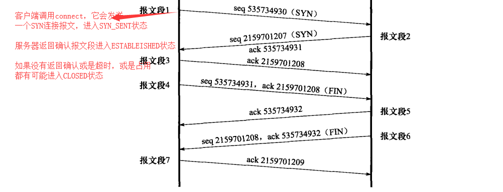
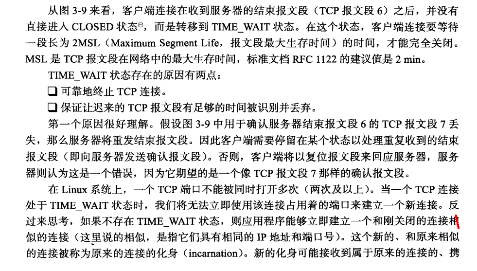
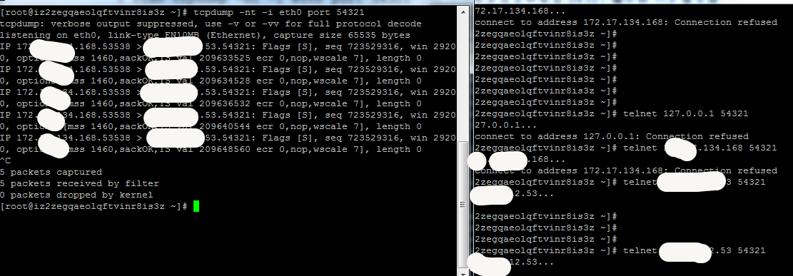
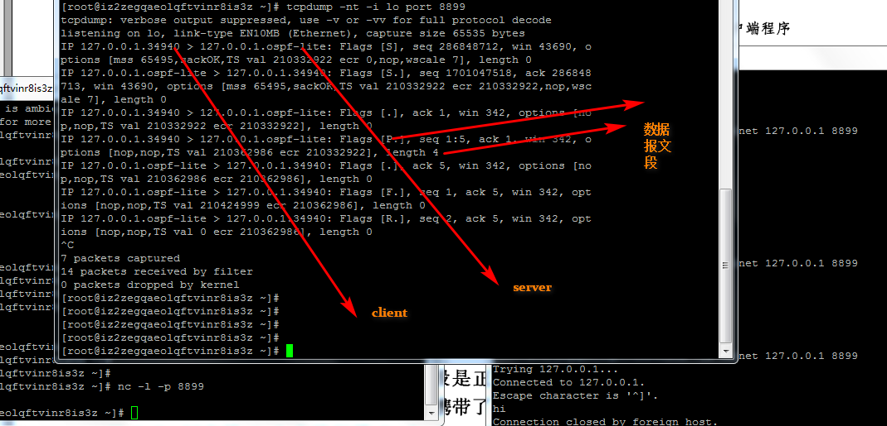

###tcp 连接状态
- 状态转移
    服务器通过listen系统调用进入LISTEN状态，等待客户端连接，客户端连接后放入系统内核
    等待队列，并发送一个SYN标志的确认报文段，此时进入SYN_RCVD状态，如果客户端返回一个应答确认报文段
    则进入了ESTABLISHED状态，即他们进入了连接状态，可以相互发送数据的状态

    客户端调用close/shutdown发送一个结束报文段给服务器，服务器返回确认报文段，此时进入CLOSE_WAIT
    状态，服务器也发送结束报文段给客户端的时候，此时进入LAST_LOCK状态，客户端返回确认报文段就会真的
    关闭连接了

    状态图
    

    客户端的状态转移说明
    客户端通过connect系统调用，connect会发送一个SYN连接报文段，此时进入SYN_SENT状态
    如果服务器
    1、目标端口不存在，但没有任何进程监听，此时可能会收到复位RST报文段，或是TIME_WAIT状态
    2、端口存在，但连接超时，没有收到服务器的确认报文段

    如果连接成功进入ESTABLISHED状态

    客户端发送FIN结束报文段的时候，进入FIN_WAIT1状态，如果服务器确认则进入FIN_WAIT2状态
    此时服务器已经是CLOSE_WAIT状态了，当服务器也发送FIN结束报文段的时候，客户端确认后进入TIME_WAIT
    状态

    状态图
    连接状态
    

    关闭状态
      
    
    tcp 孤儿连接  
    就是客户端发送了FIN的结束报文段，服务器确认，但是服务器根本没有发送FIN结束报文段，客户端  
    先强行关闭了，导致产生了孤儿连接   
      
    
    tcp连接到断开的状态转移图  
      
    
- TIME_WAIT存在的原因   
      
    
- RST复位报文段    
  客户端连接找不到对应的端口时，会重新发起连接请求R报文段    
  
  
- TCP异常终止连接  
        
    
- TCP半打开状态  
    客户端或服务器端关闭了或是异常关闭，对方没有收到结束报文段【如网络故障】，而此时  
    客户端或服务器还是维持原来的连接，即使重启也没有该连接的任何信息了，称为半打开状态  
    处于此状态，对连接进行写数据时，对方会发起一个复位RST报文段  
      
    
    测试  【nc工具测试】  
      
    
- TCP交互数据流   
    交互数据和成块数据    
      
- 带外数据    
    TCP的紧急事件就是带外数据，会将本端重要事件优秀发送到对端   
    带外数据【OOB对应的有带内数据普通数据】    
    
- TCP 超时重传   
    TCP模块会为每一个TCP报文段维护一个定时器，在第一个TCP报文段发送时  
    会启动一个定时器，如果超时未收到对方的确认报文段，TCP模块将重传TCp报文段  
    并重置定时器，关于下次重传定时器时间，以及重传次数  
    就是linux下的TCP超时重传策略   
    